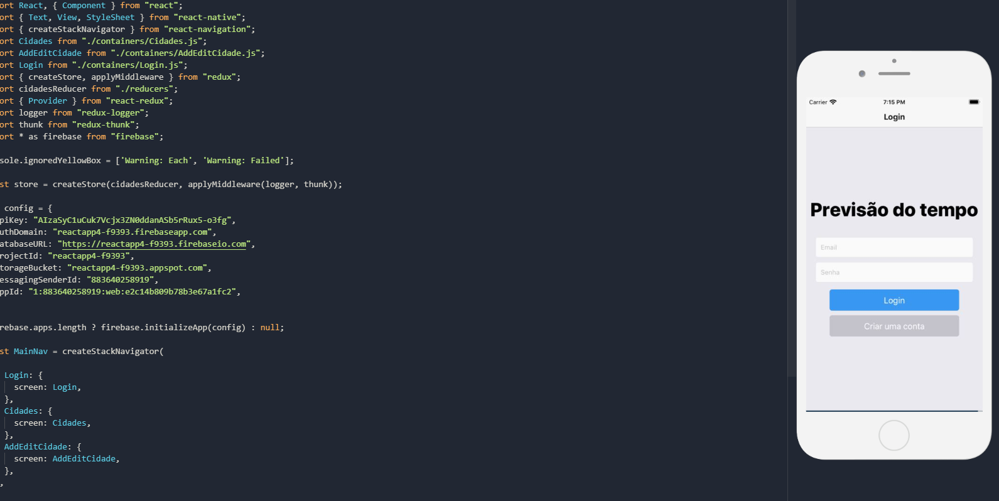
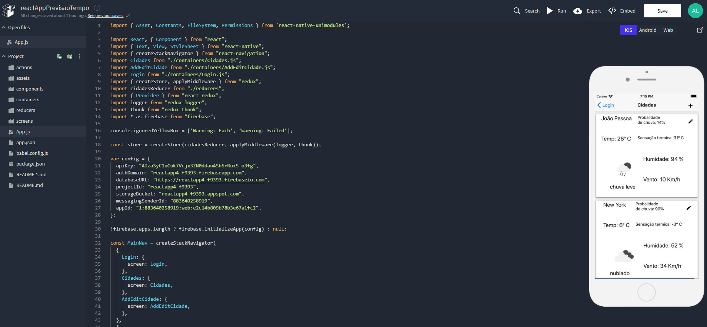

# React App Previsao do Tempo

Welcome APP!

As informações devem ser recuperadas de um Web Services de terceiros ativo (ver lista em: https://www.programmableweb.com/) 
ou serviço de base de dados remota (por exemplo, usando Firebase ou outro SDK);  ✅

Deve ter uma lista de entidades padrão (pré-baixadas) no aplicativo (por exemplo, na aplicação de previsão de tempo já 
abre com as cidades Barcelona, Dublin, Londres, Nova York);  ✅

O usuário deve poder adicionar uma nova entidade a partir do web services (por exemplo, uma nova cidade);  ✅

O usuário deve poder remover uma entidade da lista (por exemplo, remover uma cidade da lista de cidades);  ✅

Todas as alterações devem ser persistentes. Se o usuário adicionar ou remover uma entidade, a alteração deverá persistir 
quando o aplicativo for reiniciado;  ✅

Os dados que já foram recuperados do Web Services também devem ser persistidos localmente de modo que o usuário possa 
acessar esses dados mesmo sem conexão com a Internet;  ✅

O aplicativo deve apresentar os dados de entidade em dois modos (retrato e paisagem) de exibição gráfica com Views 
diferentes (por exemplo, mostra a previsão de tempo de uma cidade numa tabela no modo retrato e um gráfico no modo paisagem);  ✅


```jsx
// redux-thunk é um middleware que permite que as ações do Redux retornem operações assíncronas
// Uma thunk envolve uma expressão para atrasar sua avaliação.
export const loginThunk = () => {
    return async (dispatch, getState) => {
        try {
            const response = await firebase.auth().signInWithEmailAndPassword(getState().email, getState().password)
            dispatch({ type: LOGIN, payload: response.user });
        } catch (e) {
          dispatch({ type: ERROR, payload: e });
        }
    }
}

// redux-thunk é um middleware que permite que as ações do Redux retornem operações assíncronas
export const signupThunk = () => {
    return async (dispatch, getState) => {
        try {
            const response = await firebase.auth().createUserWithEmailAndPassword(getState().email, getState().password);
            dispatch({ type: SIGNUP, payload: response.user });
        } catch (e) {
          dispatch({ type: ERROR, payload: e });
        }
    }
}
```


Implementado com:
When you're ready to see everything that Expo provides (or if you want to use your own editor) you can **Export** your project and use it with [expo-cli](https://docs.expo.io/versions/latest/introduction/installation.html).


# Tela

<p align="center">
	<br>
	
      <br>
</p>
<p align="center">
	<br>
	
      <br>
</p>
